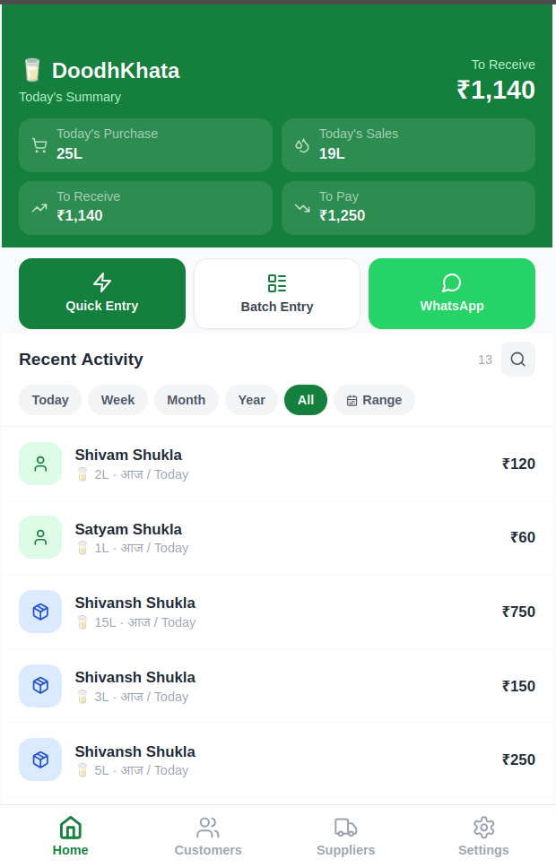
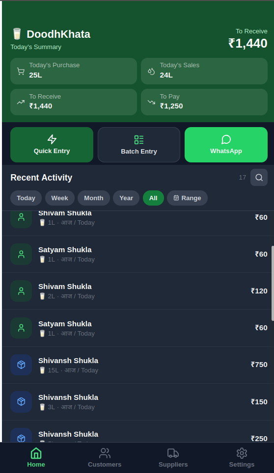
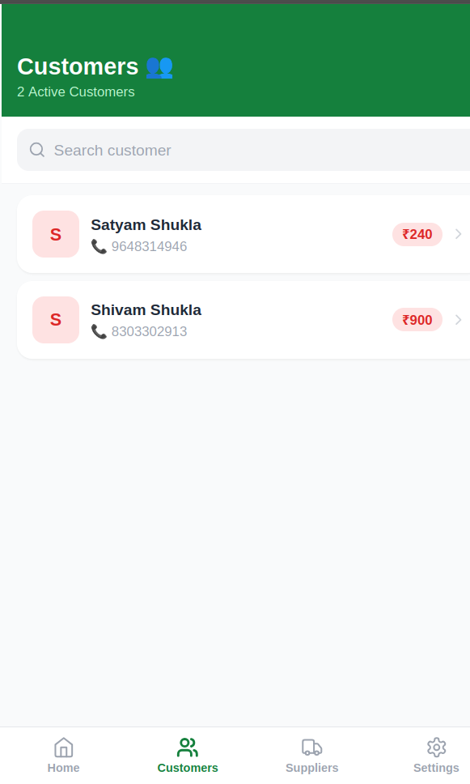
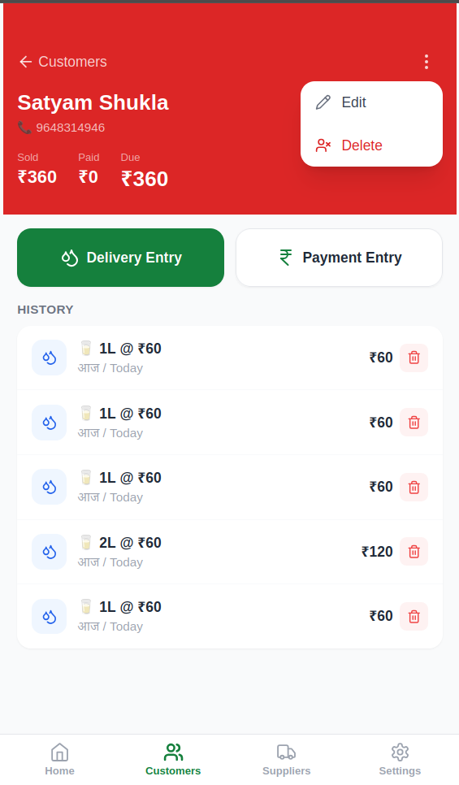
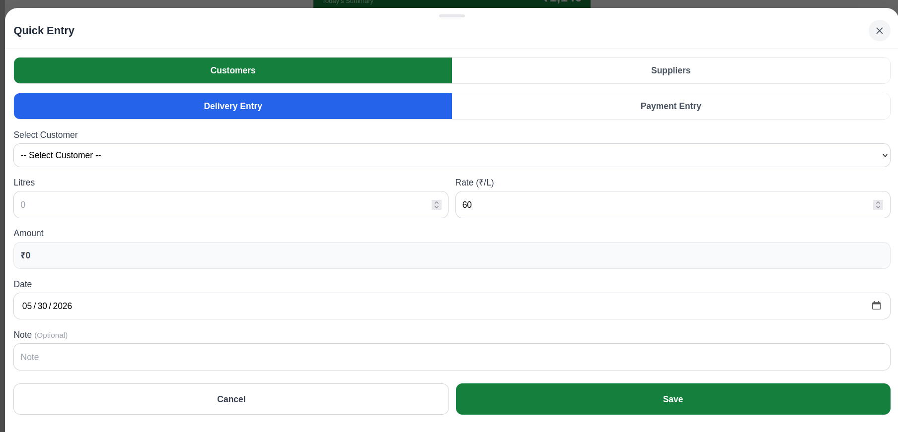
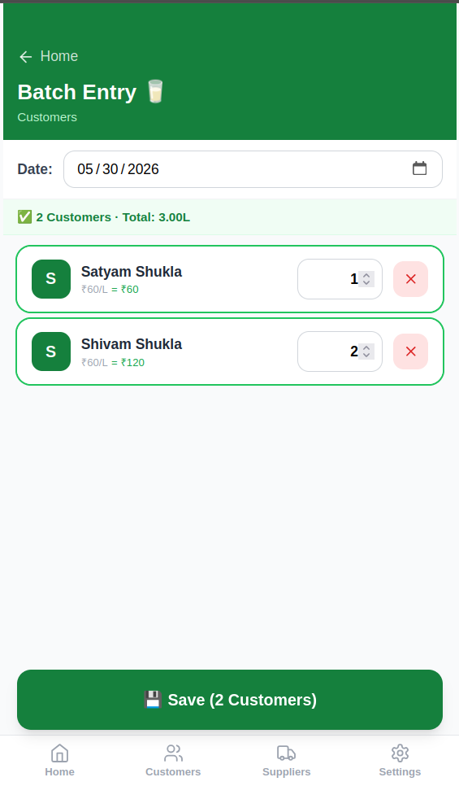
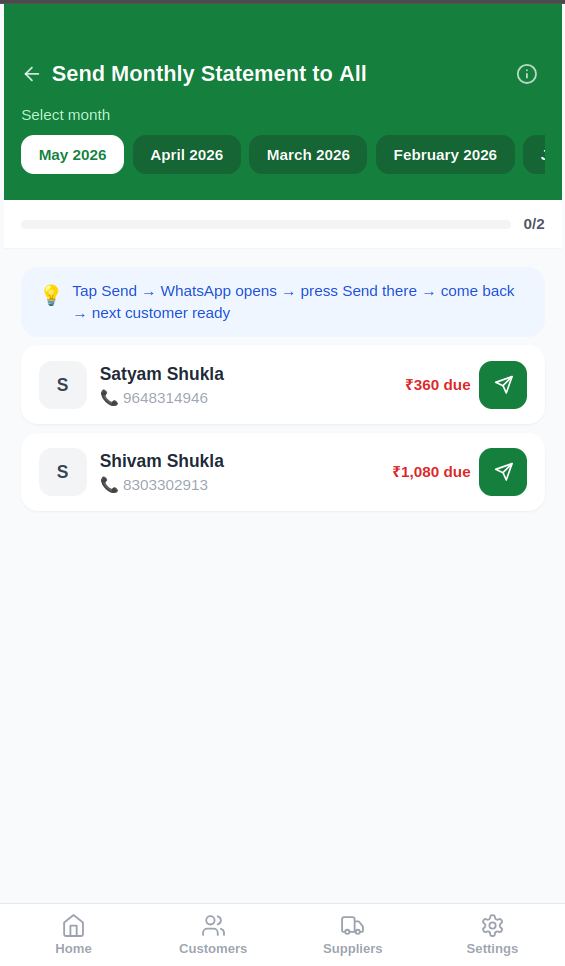
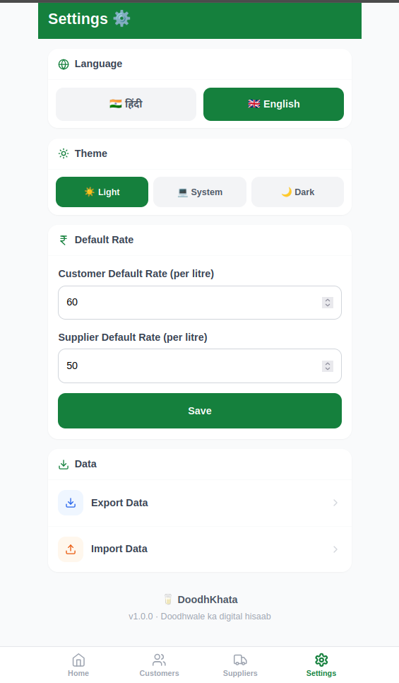

# DoodhKhata — दूधखाता

> दूधवाले का digital हिसाब

A mobile-first offline Progressive Web App for small milk sellers to track daily deliveries, payments, and running balances — for both customers and suppliers.

---

## Screenshots

<p align="center">
  
  
  
  
</p>
<p align="center">
  
  
  
  
</p>

---

## Screens & Features

### Home Dashboard
- Daily summary: today's purchases (litres), today's sales (litres), total to receive, total to pay
- Outstanding balance ("To Receive") shown prominently at a glance
- Three quick-action buttons: **Quick Entry**, **Batch Entry**, **WhatsApp**
- **Recent Activity** feed showing all transactions across customers and suppliers
- Activity count with search by name and filter by Today / Week / Month / Year / All / Custom Date Range

### Customers & Suppliers
- Separate lists for customers (buyers) and suppliers (milk sources)
- Each card shows name, phone number, and current outstanding balance
- Balances in red = money owed to you (customer) or you owe them (supplier)

### Customer / Supplier Detail
- Header showing total **Sold**, **Paid**, and **Due** at a glance
- Full transaction history: each delivery and payment with date and amount
- Add **Delivery Entry** or **Payment Entry** directly from the detail screen
- Edit or delete the customer/supplier via the top-right menu
- Delete individual transactions from history

### Quick Entry
- Fast entry for a single customer or supplier
- Switch between **Customers** and **Suppliers**, and between **Delivery** and **Payment**
- Auto-calculates amount from litres × rate
- Pre-fills today's date; optional note field

### Batch Entry
- Add deliveries for all customers (or suppliers) in one go
- Date picker at the top applies to all entries
- Live summary bar: number of customers and total litres
- Remove any customer from the batch with the × button
- After saving, prompts to send WhatsApp messages one by one

### WhatsApp Messaging
- After any entry, option to send a balance reminder via WhatsApp
- **Bulk Send** screen: send monthly statements to all customers
  - Scrollable month selector (current and past months)
  - Progress bar showing how many messages sent
  - Instructions guide: tap Send → WhatsApp opens → send there → come back → next customer ready
  - Each row shows name, phone, amount due, and a direct send button

### Settings
- **Language** — Hindi (हिंदी) or English
- **Theme** — Light, Dark, or follow System
- **Default Rate** — set separate default rates (₹/L) for customers and suppliers
- **Data Backup** — export all data as JSON or import from a backup file

---

## Tech Stack

| Layer | Technology |
|---|---|
| UI | React 18 + TypeScript |
| Build | Vite |
| Styling | Tailwind CSS |
| Storage | IndexedDB via `idb` |
| PWA | vite-plugin-pwa + Workbox |
| Routing | React Router v6 |
| Icons | Lucide React |

---

## Run Locally

```bash
npm install
npm run dev
```

## Build for Production

```bash
npm run build
```

## Live App

[doodhkhata.vercel.app](https://doodhkhata.vercel.app)
